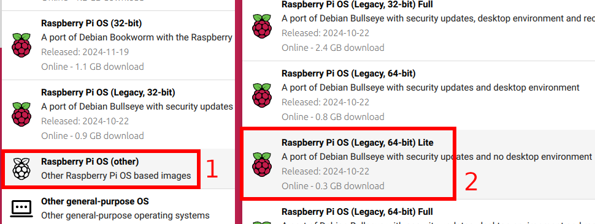

# Ballmaze
This project is showcased in ...add link to yt-video/channel...

The goal is to automate playing the ballmaze dexterity game. There are quite a few challanges in this and a lot of things can be improved from the current solution. 

<p align="center">
  
  
</p>

## Want to build one yourself?
It's still a work in progress but it works. Some previous experience with a RaspberryPi or similar and a little experience in programming in Python would surely help. And of couse a great interest in robotics/control/machine learning :) <br>
In total the materials cost about 50 - 90 $/€ depending on whether you or someone you know has a 3D printer, or you have to order the 3D printed parts from somewhere. 

### List of materials
Most parts can be replaced by similar ones or whatever you might already have. 

| Part                                              | Price ($/€ approx) | Where to buy |
|---------------------------------------------------|--------------------|--------------|
| 1x RaspberryPi Zero 2W (or better)                | 15                 | [1](https://www.mouser.ch/ProductDetail/358-SC0721) |
| 2x Servo (e.g. SER0050)                           | 5 (x2)             | [1](https://www.mouser.ch/ProductDetail/426-SER0050) |
| 1x Pi Camera V1.3                                 | 7                  | [1](https://www.mouser.ch/ProductDetail/713-114110127) |
| 1x Pi Camera Cable 300mm                          | 2                  | [1](https://www.mouser.ch/ProductDetail/358-SC1129) |
| 1x uSD card 32GB+                                 | 5                  | [1](https://www.mouser.ch/ProductDetail/358-SC1628) |
| 1x 5V 2A+ USB charger (likely already got one)    | 5                  | [1](https://www.mouser.ch/ProductDetail/490-SWI10B-5-EW-I38) |
| 1x USB Cable to power Pi (micro USB for Pi Zero)  | 2                  | [1](https://www.mouser.ch/ProductDetail/530-SC-2AMK003F) |
| A few metal balls with diameter ~6mm              | 5                  | [1](https://www.amazon.com/0-236-Precision-Chrome-Steel-Bearing/dp/B07L8MLK2N) |
| 3D printed Parts (~300g PLA/PETG)                 | 5 - 40             | [1](https://www.sculpteo.com) [2](https://craftcloud3d.com/) [3](https://jlc3dp.com/3d-printing-quote) |
| Some cables + soldering iron would be<br>useful to connect the servos (not required) |                    |  |
| 2x Googly eyes (strictly required) |                    |  |

*If you built this, please send me a link to where you bought the parts, so I can add them to the table.*

### Physical setup
... some pictures & stuff ...

### Setup on the PC
To get the code on your PC running, first download the repo as a .zip and unpack, or clone it to a local folder. <br>
There are requirements.txt files in the respective folders. Those were generated with Python 3.12.3, so might not work exactly the same for other versions. <br>
To execute the Python scripts and try the algorithms provided here, first set up a Python virtual environment (venv) in each of the folders which contain python files. <br>
In a Linux terminal it would be: <br>
if not installed: `sudo apt install python3-venv` <br>
`cd Code_on_PC/` or other folders <br>
`python3 -m venv .venv` creates the virtual environment<br>
`source .venv/bin/activate` activates the venv (has to be executed again after you open a new terminal later on)<br>
`pip install -r requirements.txt` installs the list of packages<br>
 for Windows/Mac it is similar, see here [docs.python.org/3/library/venv.html](https://docs.python.org/3/library/venv.html) <br>
Alternatively you can also install the Python packages manually.

### RaspberryPi setup
I used a RaspberryPi Zero 2w, so Pi 3,4 or 5 should work too. Or any other single-board computer should work if it has the features I use from the RaspberryPi: <br>
- 2 Hardware PWMs to control the servos. (Software PWMs, at least on my Pi, don't work for servos under load)
- Connection to the camera (Picam Zero v1.3 in my case)
- Enough computation power to run 4fps object detection on at least 128x128px images.
- Connection to a PC (SSH over local Wi-Fi in my case, USB also possible)

A good tutorial to set up a RaspberryPi with PiOS to then communicate to your PC over your local Wi-Fi via SSH can be found here: [randomnerdtutorials.com/installing-raspbian-lite-enabling-and-connecting-with-ssh](https://randomnerdtutorials.com/installing-raspbian-lite-enabling-and-connecting-with-ssh/) (Skip steps 3 & 4 by already doing them in step 2 as it says. )<br>

I'll here describe the steps to get my exact Pi software setup. If you have a different RaspberryPi that the zero 2w or in the future, it might not work exactly as is: <br>
Set up the Pi as it says in the tutorial linked above and choose the Pi OS **Legacy 64-bit Lite** version in the Pi Imager:

Once you can connect to the Pi over the terminal, follow these steps: <br>
- Open a SSH terminal on the Pi and check the OS version with the command:
```bash
uname -m
```
this should show: `aarch64`. If it shows `armv7l` you choose the 32bit version which will not work, rewrite the image onto the SD card with the 64bit version.<br>
Then run:
```bash
cat /etc/os-release
```
This should show: (if not, the wrong version might have been selected in the Pi Imager)
```plaintext
PRETTY_NAME="Debian GNU/Linux 11 (bullseye)"
NAME="Debian GNU/Linux"
VERSION_ID="11"
VERSION="11 (bullseye)"
VERSION_CODENAME=bullseye
ID=debian
HOME_URL="https://www.debian.org/"
SUPPORT_URL="https://www.debian.org/support"
BUG_REPORT_URL="https://bugs.debian.org/"
```
- Also on the Pi, run the commands: (takes a rew minutes)
```bash
sudo apt update
sudo apt -y upgrade
sudo apt install -y libgl1
sudo sed -i '1i\# enables hardware PWM on pins GPIO_18, GPIO_19 (Pins 12, 35)\ndtoverlay=pwm-2chan\n# limits camera memory to 320MB, not required on e.g. a Pi 4/5\ndtoverlay=vc4-kms-v3d,cma-320\n' /boot/config.txt
sudo reboot
```
This restarts the Pi, connect to it again. 
- Download this git repo to your PC (if not already done).
- Copy the folder **Code_on_RaspberryPi** the the /home/USER directory on the Pi.<br>
  USER and DEVICE are whatever you called them in the Pi imager, USER is `pi` by default.<br>
  For this open a <ins>**termina/Powershell on your PC**</ins> and run:<br>
```bash
scp -r path/on/your/PC/to/the/folder/Code_on_RaspberryPi USER@DEVICE.local:/home/USER
```
Alternatively you can also copy the folder onto the SD card. 
- Now back to the Pi SSH terminal, check if it has the `Code_on_RaspberryPi` folder by:
```bash
ls
```
this should show the folder: `Code_on_RaspberryPi`
- Run these commands still in the current (`home/pi`) directory:
```bash
sudo apt install python3-picamera2 --no-install-recommends
sudo apt install -y python3-venv
cd Code_on_RaspberryPi
python3 -m venv --system-site-packages .venv
source .venv/bin/activate
pip install --upgrade pip
pip install openvino opencv-python zmq rpi_hardware_pwm skopt
```
It now shows `(.venv)` at the start of the line in the terminal, which indicated the venv is running ([Read more about venv](https://docs.python.org/3/library/venv.html)). Whenever you open a new terminal, go to the Code-folder with `cd Code_on_RaspberryPi` and activate the venv with `source .venv/bin/activate`. 
- Run this Python script to check the installation:
```bash
python3 check_installation.py
```
It if gives any errors, read it and try re-running the installation commands it might correspond to. 

### Check setup
Now slide the empty-maze-plate in and put a metal ball on it. Then run the script `python3 check_everything_PC.py` on the PC together with `python3 check_everything_Pi.py` on the Pi while connected to the same Wi-Fi.

When the check was succesfull, run `python3 pi_calibration.py` on your PC with the empty-maze-plate still inserted. <br>
It is recommended to run `pi_calibration.py` before every session. It measures the relative position of the camera and adjusts it for lighting conditions. 

## Current progress and goals
The sort of end goal is to come up with a solution/algorithm which will train on one or more given maze layout(s) for a fixed ammount of time. Then it will get a new maze layout it hasn't seen before and has to complete that in the minimum ammount of time. 

### Attempt 1 - SAC with 4 state variables
*Not the first appempt, but the first one that sort of worked :)* <br>
I used the RL (reinforcement learning) algorithm SAC (Soft Actor-Critic) to control the ball. The algorithm just gets the current ball position in the maze (x,y in 0...1), the current tilt angle of the maze ($\theta_x$, $\theta_y$ in -1...1), and a reward. It then can change the two angles up to a maximum of a fixed portion of the max-angle. It gets a reward if the current position is further trough the maze than it was before in this episode. It gets punished/negative reward for falling in a hole and then some smaller adjustments. <br>
After a few hours of training it made some progress and got about a 4th of the way through the maze. But there is little hope of generalization with this attempt. 

### Attempt 2 - SAC with CNN + 2 variables state-space
As in Attempt 1, but the position (x,y) was replaced by a 29x29px, 3 channel image of the balls surroundings, centered on the ball. The first two channels are one-hot encoded positions of the holes and walls. The third channel is the progress trough the maze from 1 at the start to 255 at the end, where holes and walls have values of 0. <br>
This ...

### Attempt 3 - Fitting a dynamics model and training in simulation
With the empty-maze-plate ...


